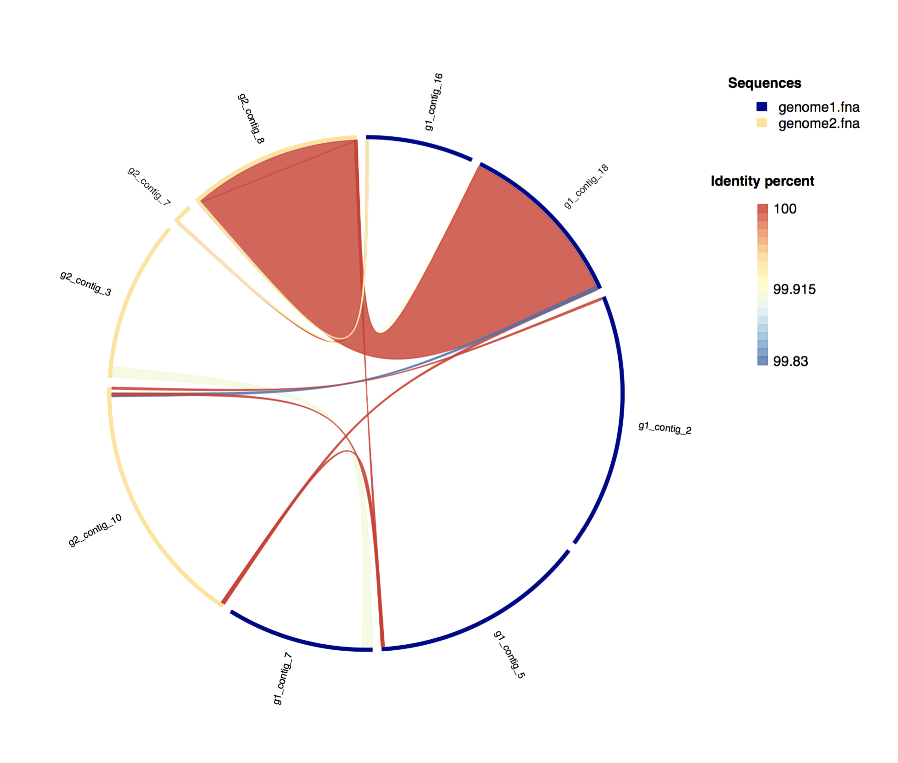
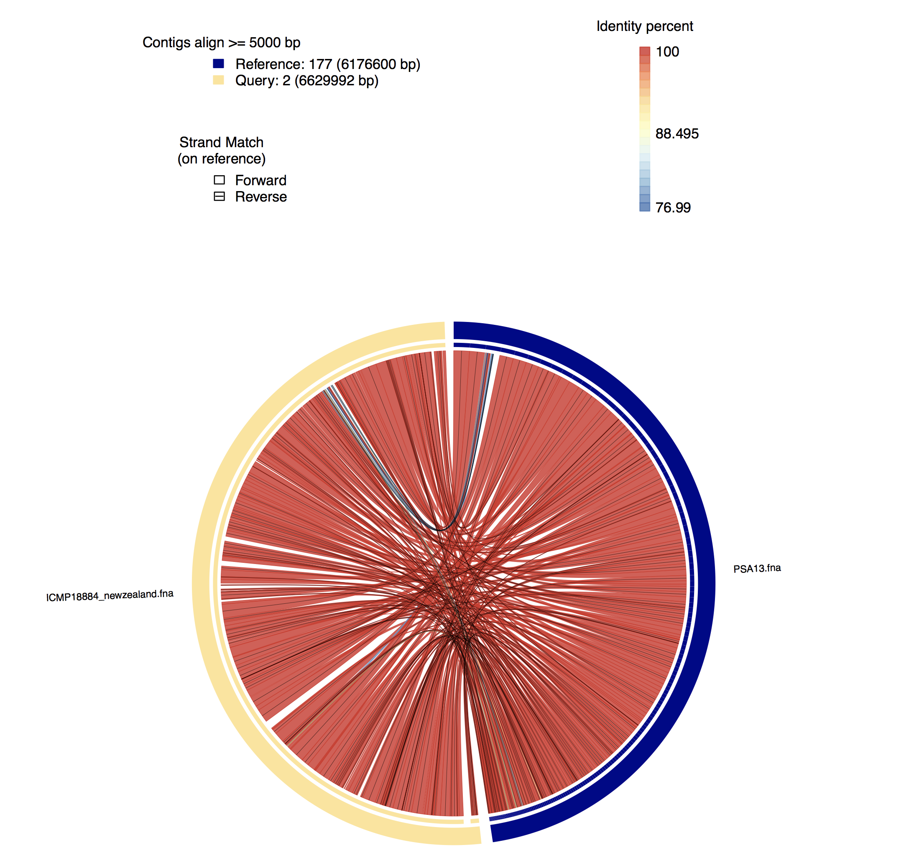

# GGisy
Genome-Genome circle synteny is a program that show the closest regions between two genomes along the all contigs using blast+. The program can cutoff (defined by user), the regions size based on the aligments length and their identities. You can use this software to plot the similiraty between two or more regions (or whole genomes).

## Example output

------

## Requeriments

* R (tested in 3.3.1) with the following libraries:
	* omiccircos
	* RColorBrewer
	* varhandle

* Python v2.7 with biopython library
* BLAST+

## Usage

GGisy have two ways to run, the easy and complete:

easy:

	python GGisy.py -r example/genome1.fna -q example/genome2.fna
	
where:

* -r is the reference genome (in fasta format)
* -q is the query genome to be used against the reference (in fasta format).

complete:

	python GGisy.py -r example/genome1.fna -q example/genome2.fna -l 10000 -i 50 -t 8 -c False
	
where:

* -r is the reference genome.
* -q is the query genome to be used against the reference.
* -l is the aligment length cutoff to post processing.
* -i is the identity cutoff for the aligment.
* -t is the threads used for blastn
* -c is a boolean to delete the files generated or not (True by default).

### Examples:

Synteny between two genomes filtering regions <= 5000bp:

	python GGisy.py -r example/genome1.fna -q example/genome2.fna -l 10000 -i 50 -t 8 -c False
	
Synteny between two genomes conserving all files (indexes, raw blast output, parsed blast output, etc.)

	python GGisy.py -r example/genome1.fna -q example/genome2.fna -c False

Synteny between two genomes setting identity percent cutoff:

	python GGisy.py -r example/genome1.fna -q example/genome2.fna -i 90

## Trick

* You can avoid the blast work if you provide a blast output with "-b" (output format 6 is mandatory), with this parameter the program jump directly to parse it and you only have to define the cutoffs (or not).

example:
	
	python GGisy.py -r [reference] -q [query] -l 10000  -b myBlastOutput.tsv

* GGisy have an option to don't delete the files (**-c False**), if you run for the first the program you notice a file called **tmp.tsv**, this file es the blast output in format 6, and you can avoid the next run just passing this file with the **-b** option, I recommend to use this option to re-run the program with another cutoff parameters (**-l** and **-i**)
	
## Warnings

* The contigs name between the two genomes must be uniques.
* A lot of contigs will cause the graph not legible, try to filter with ``-l`` parameter, or reduce your contigs number.

## External useful tools
check for these tools to extract some useful information from your data:

* [multiGenomicContext](https://github.com/Sanrrone/multiGenomicContext): Check the genomic context of several genomes or sequence just providing the GBK files.

* [fetchMyLineage](https://github.com/Sanrrone/fetchMyLineage): Return the complete lineage of your organism just providing the genus and species names.

* [extractSeq](https://github.com/Sanrrone/extractSeq): Extract and size defined sequence from and specific contig, from and specific genome.

* [plotMyGBK](https://github.com/Sanrrone/plotMyGBK): Plot your GBK in a circular graph with COG categories.

* [pasteTaxID](https://github.com/Sanrrone/pasteTaxID): fetch the taxonomic IDs to your fastas.

* [GGisy](https://github.com/Sanrrone/GGisy): Plot synteny of two sequence (you can use two genomes), and see the identity of the matched regions.

* [getS2](https://github.com/Sanrrone/getS2): obtain the order parameter to each residue of your simulation.
