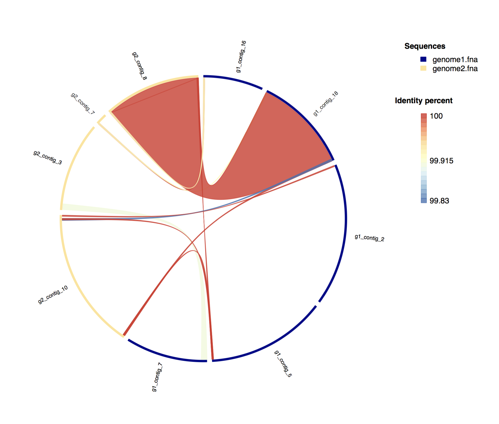
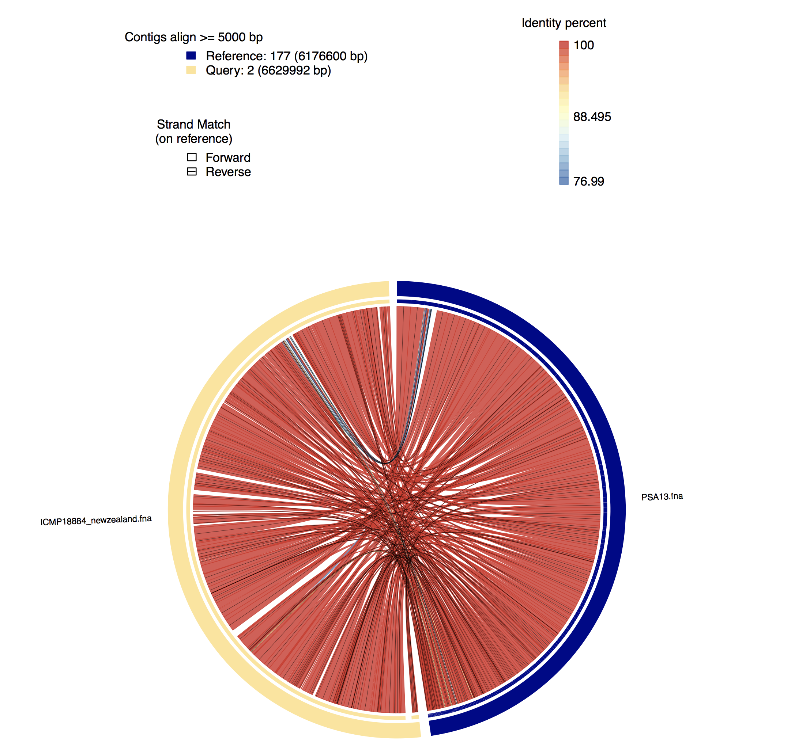

# GGisy

**Genome-Genome circle synteny.** GGisy compares two genomes (or any two sets of sequences) with BLAST+ and draws the matching regions as a circular synteny plot, with every link coloured by its percent identity. It works with complete genomes and with draft assemblies made of many contigs.





## How it works

1. Builds a BLAST database from the reference and searches the query against it with `blastn`, on both strands.
2. Keeps only the matches that pass three cutoffs: alignment length, percent identity, and how much of the query contig the alignment covers.
3. Draws the reference contigs (dark blue) and the query contigs (yellow) around a circle and links the matching regions, coloured from the lowest identity kept up to 100%. Only contigs with at least one match are drawn.

The output files are named after the `-o` prefix (default `synteny`):

| File | Content |
|---|---|
| `synteny.pdf` | the circular synteny plot |
| `synteny_parsed.tsv` | the matches that passed the cutoffs: query contig, reference contig, percent identity, query start and end, reference start and end |

## Requirements

- Python 3 with Biopython
- BLAST+ (`blastn` and `makeblastdb` on your `PATH`)
- R (`Rscript` on your `PATH`) with the packages OmicCircos (Bioconductor), RColorBrewer and varhandle

One way to install them:

```bash
pip install biopython
sudo apt install ncbi-blast+        # or: conda install -c bioconda blast
Rscript -e 'install.packages(c("RColorBrewer", "varhandle", "BiocManager"), repos = "https://cloud.r-project.org")'
Rscript -e 'BiocManager::install("OmicCircos")'
```

## Quick start

```bash
git clone https://github.com/sanrrone/GGisy.git
cd GGisy
python GGisy.py -r example/genome1.fna -q example/genome2.fna
```

This writes `synteny.pdf` and `synteny_parsed.tsv` to the current directory.

## Options

| Option | Meaning | Default |
|---|---|---|
| `-r`, `--reference` | reference genome, FASTA (required) | |
| `-q`, `--query` | query genome, FASTA (required) | |
| `-l`, `--alignmentLength` | minimum alignment length, in bp | 1000 |
| `-i`, `--identity` | minimum percent identity of an alignment | 50 |
| `-c`, `--coverage` | minimum alignment length as a percentage of the query contig's length | 50 |
| `-e`, `--evalue` | E-value cutoff for `blastn` | 1e-3 |
| `-t`, `--threads` | threads used by `blastn` | 4 |
| `-o`, `--outprefix` | prefix for the output files | synteny |
| `-b`, `--blastout` | use an existing BLAST table instead of running BLAST (see below) | |
| `-k`, `--keepfiles` | keep the intermediate files; takes no value | files are deleted |

## Examples

Keep only long and close matches, at least 10 kb and 90% identity, using 8 threads:

```bash
python GGisy.py -r example/genome1.fna -q example/genome2.fna -l 10000 -i 90 -t 8
```

Relax the filters for short sequences such as plasmids or single loci, and name the output:

```bash
python GGisy.py -r plasmid_A.fna -q plasmid_B.fna -l 200 -c 10 -o plasmids
```

## Trying other cutoffs without running BLAST again

BLAST is the slow step. Run once with `-k`, which keeps the raw BLAST table as `tmp.tsv`, copy that table to a name of your own, and reuse it with `-b`:

```bash
python GGisy.py -r example/genome1.fna -q example/genome2.fna -k
cp tmp.tsv blast.tsv
python GGisy.py -r example/genome1.fna -q example/genome2.fna -b blast.tsv -l 5000 -i 80 -o strict
```

Copy the table first because any run without `-k` deletes `tmp.tsv` when it finishes.

You can also pass a BLAST table made elsewhere. It must be tabular, with the query genome (`-q`) as query and the reference genome (`-r`) as subject, and with these 13 columns in this order:

```bash
-outfmt "6 qseqid sseqid pident length mismatch gapopen qstart qend sstart send evalue bitscore qlen"
```

The standard `-outfmt 6` has only 12 columns and lacks `qlen`, which GGisy needs to compute coverage.

## Good to know

- **Contig names must be unique across both files.** A contig called `contig_1` in both genomes breaks the plot, so add a prefix to the names in one of them first.
- **Many contigs make the plot hard to read.** With more than 20 matched contigs in total, GGisy labels the two genomes instead of each contig. Raising `-l`, or removing short contigs before running, keeps the plot legible.
- **One run per directory at a time.** GGisy writes its temporary files (`tmp.tsv`, the `ref.*` BLAST database, `handle.R`) into the current directory, so two runs in the same directory overwrite each other.
- **No plot means no matches.** If nothing passes the cutoffs, GGisy prints `No match between query and reference` and stops. Lower `-l`, `-i` or `-c`.

## Other tools

- [multiGenomicContext](https://github.com/sanrrone/multiGenomicContext): see a protein in many genomic contexts from your GenBank files.
- [extractSeq](https://github.com/sanrrone/extractSeq): extract a region from a contig, given its name and start and end positions.
- [QOVirome](https://github.com/sanrrone/QOVirome): a pipeline for mining phages, viruses and bacteria from metagenome assemblies.

## License and contact

GGisy is released under the Apache License 2.0 (see [LICENSE](LICENSE)). For bugs and questions, open an issue at https://github.com/sanrrone/GGisy/issues. If GGisy is useful in your work, please cite this repository.
